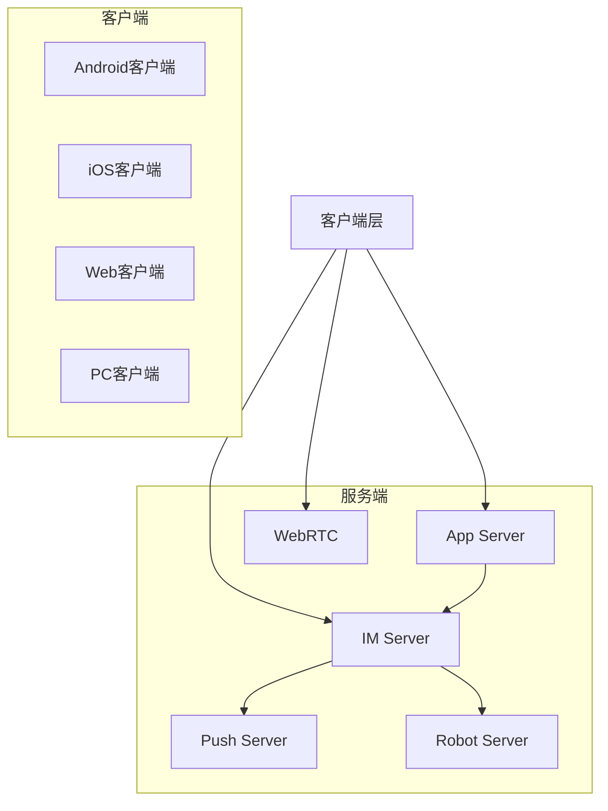

即时通讯(IM)已经成为现代应用不可或缺的功能。本文将深入探讨如何构建一个功能完整、性能强大的跨平台IM系统。

<!--truncate-->

## 什么是 IM 即时通讯系统

即时通讯(Instant Messaging, IM)是一种实时通信技术,允许用户通过互联网进行文字、语音、视频等多种形式的即时交流。一个完整的IM系统通常包括:

- **客户端**: 支持多平台(Web、移动端、桌面端)
- **服务端**: 消息路由、存储、推送等核心功能
- **音视频**: 实时音视频通话能力
- **推送服务**: 离线消息推送
- **应用服务**: 用户管理、好友关系等业务逻辑

## 野火IM解决方案

[野火IM](https://github.com/wildfirechat/vue-pc-chat) 是一个专业级的即时通讯和实时音视频整体解决方案,具有以下特点:

### 核心特性

- **私有部署**: 数据安全可控,满足企业级安全需求
- **性能强大**: 高并发、低延迟的消息传输
- **功能齐全**: 单聊、群聊、音视频通话、文件传输等完整功能
- **全平台支持**: Android、iOS、Web、PC(Windows/macOS/Linux)全覆盖
- **高开源率**: 核心代码开源,便于二次开发
- **易于集成**: 可轻松嵌入现有系统或与第三方系统对接

### 技术架构

野火IM采用模块化架构设计,主要包含以下组件:



## PC 客户端技术实现

以野火IM的PC客户端为例,采用了现代化的技术栈:

### 技术选型

- **前端框架**: Vue 3 - 渐进式JavaScript框架
- **桌面框架**: Electron - 跨平台桌面应用开发
- **构建工具**: 现代化的前端构建工具链
- **音视频**: WebRTC - 实时音视频通信

### 开发环境配置

#### macOS 环境

```bash
# 安装依赖
# 1. 安装最新版本的 Xcode
# 2. 安装 Node.js v18.19.0
# 3. 安装构建工具
npm install -g node-gyp@8.3.0
```

#### Windows 环境

```bash
# 安装 Windows 构建工具
npm install --global --vs2019 --production windows-build-tools

# 安装 node-gyp
npm install -g node-gyp@8.3.0
```

#### Linux 环境

```bash
# 确保安装以下依赖
# - Node.js v18.19.0
# - Python 2.7.x
# - Git
# - binutils (避免打包失败)
```

### 项目配置

1. **配置镜像源** - 在 `.npmrc` 文件中添加:

```ini
ELECTRON_MIRROR=https://npmmirror.com/mirrors/electron/
ELECTRON_BUILDER_BINARIES_MIRROR=https://npmmirror.com/mirrors/electron-builder-binaries/
registry=https://registry.npmmirror.com/
```

2. **安装依赖**:

```bash
npm install
# 或使用 CI 模式
npm ci
```

3. **启动开发服务器**:

```bash
npm run dev
```

### 打包部署

支持多种打包方式:

```bash
# 打包当前平台
npm run package

# 交叉编译
npm run cross-package-win      # Windows amd64
npm run cross-package-win32    # Windows x86
npm run cross-package-linux    # Linux amd64
npm run cross-package-linux-arm64  # Linux arm64
npm run cross-package-mac      # macOS
```

## 音视频功能

野火IM集成了完整的音视频通话功能,基于 WebRTC 技术实现:

### 主要特性

- **一对一通话**: 支持语音和视频通话
- **多人会议**: 支持多人音视频会议
- **屏幕共享**: 支持屏幕共享功能
- **免费版本**: 默认提供免费版音视频功能
- **高级版本**: 提供更强大的音视频能力

### 技术优势

- 低延迟、高质量的音视频传输
- 自适应码率调整
- 网络抖动优化
- 回声消除和噪声抑制

## 开发最佳实践

### 1. 版本选择

- **Vue 3 分支(master)**: 推荐使用,是未来的开发重心
- **Vue 2 分支**: 已进入维护模式,建议升级到 Vue 3

### 2. 注意事项

> [!WARNING]
> - 避免将项目放在中文路径下,可能导致依赖安装失败
> - 不推荐使用 cnpm,建议使用 npm 或 yarn
> - 代码路径中不能包含中文或空格

### 3. 调试技巧

使用 Vue DevTools 进行调试:

```bash
# 安装 Vue DevTools
npm install -g vue-devtools

# 启动 DevTools
vue-devtools

# 在项目中注入调试脚本
# 将 script 标签添加到 public/index.html
```

### 4. GitHub Actions 自动打包

支持使用 GitHub Actions 进行在线打包:

1. Fork 仓库到自己的账号
2. 修改 `.github/workflows/github-actions-package.yml` 配置
3. 在 GitHub 仓库页面触发 workflow
4. 等待打包完成并下载产物

## 私有化部署

野火IM支持完全私有化部署,适合对数据安全有严格要求的企业:

### 部署步骤

1. **部署 IM Server**: 核心消息服务器
2. **部署 App Server**: 应用业务服务器
3. **配置推送服务**: 离线消息推送
4. **配置音视频服务**: 实时音视频通话
5. **客户端配置**: 修改客户端配置连接到私有服务器

### 配置示例

```javascript
// config.js
export default {
  // 修改为自己部署的 App Server 地址
  APP_SERVER: 'https://your-app-server.com',
  
  // 其他配置...
}
```

## 应用场景

IM即时通讯系统可以应用于多种场景:

- **企业内部通讯**: 替代传统邮件,提高沟通效率
- **客服系统**: 实时在线客服支持
- **社交应用**: 构建社交网络平台
- **在线教育**: 师生互动、在线答疑
- **远程协作**: 团队协作、项目管理
- **IoT 设备通信**: 设备间的实时消息传递

## 总结

构建一个完整的IM系统需要考虑多个方面:

1. **架构设计**: 模块化、可扩展的系统架构
2. **技术选型**: 选择成熟稳定的技术栈
3. **性能优化**: 高并发、低延迟的消息传输
4. **安全性**: 数据加密、权限控制
5. **用户体验**: 流畅的交互、丰富的功能

野火IM提供了一个很好的参考实现,无论是学习IM系统的原理,还是快速构建自己的即时通讯应用,都是一个不错的选择。

## 参考资源

- [野火IM官方文档](https://docs.wildfirechat.cn)
- [GitHub 仓库](https://github.com/wildfirechat/vue-pc-chat)
- [在线体验](http://web.wildfirechat.cn)
- [音视频使用说明](https://docs.wildfirechat.cn/webrtc/)

---

> **开发者提示**: 如果你正在考虑为你的应用添加IM功能,可以从开源方案入手,理解核心原理后再根据实际需求进行定制开发。野火IM的模块化设计使得它很容易集成到现有系统中。
